# JenkinsUE4

## Overview

1) Getting list of the commits from the triggered revision to the head revision and parsing this list to get and combine available build actions (build or full rebuild)
2) Updating client to the latest revision and resolving conflict on theirs automatically.
3) Checking out only needed binaries with specific extensions: exe, ext, lib, dll, target, modules, version
4) Building the binaries with default UE4 build tool.
5) Reverting unchanged files from changelist
6) Submitting changelist only
7) Cleaning up job and reverting all changed and unchanged files

If build fails then all changelist will be reverted

Builder executable input arguments:

```
Required global arguments:
	-j Jenkins Job Name
	-t Tag of Jenkins build
	-s Source Code Management type (Perforce, SVN)
	-p Project override. Must be empty if building default project

Jenkins Build Trigger:
	-handleSCMtrigger
	-c [Revision]
	-jp (Optional) Package Job
	-u Username who triggered build

Update SCM:
	-updatescm Updates SCM, automatically resolving all conflicts to "Theirs"

Resolve and cache commit info for binaries build
	-resolvesourcemarks
	-cl Write full changelog between revisions to the current Job
	    -w Workspace path (using only with -cl option)

Checkout Binaries if SCM supports it:
	-checkoutbin
	-e List of extensions of the files that should be checked out (Example: "-e exe lib target")   

Build DLL:
	-performbuild

Revert Files:
	-revertscm 
	-u Revert unchanged only

Commit DLL:
	-commitdll
	-ur

Perform full build of the project
	-performpackage
	-configuration [STR] Configuration of the build (e.g. DebugGame, Development, Shipping)
	-platform [STR] Platform to build (e.g. IOS, Win64)
	-w [STR] Jenkins workspace root
	-fullrebuild [INT] (Optional) Is full rebuild
	-distribution [INT] (Optional) Is distribution

Upload build
	-uploadbuild
	-uj Uploader Job Name

Debug:
	-debugfullpipeline
	-c [Revision]

Other:
	-suppresslogs - disable logs
	-veryverbose - all possible logs 
	-cleanup - remove all temp files of current job
	    -w (Optional) - workspace root

Logs:
	Verbose (Default) - this program logs and UE4 logs (special flag not needed in the commandline arguments)
	VeryVerbose - this program logs, UE4 logs, Perforce output and other console commands with enabled output
```
		
To see more logs from perforce and other add -veryverbose flag to the commandline.
To disable logs add -suppresslogs to the commandline.
If executable will be started without any arguments then settings window will be shown.


## Preparation

1) Install JRE (needed to run Jenkins server) on the server machine.
2) Clone git to "D:/CI/" (for example) on the server machine.
3) Download Project Repository to this machine.


## Scripts

- Run.bat - Running Jenkins Server on the port 8080 on the current machine (you can change the port in this script)

- HandleCommit.sh - Remote perforce trigger for Linux
- HandleCommit.bat - Remote perforce trigger for Windows

- post-commit.bat - Remote SVN trigger for Windows
- post-commit_Local.bat - Local SVN trigger for Windows (if build repository stores on SVN server machine, using for testing)

#### Scripts configuration

After selecting script for the SCM and platform and running Jenkins server (see Start category) we need to configure this script

```
[JENKINS_URL] - IP Address of the machine that hosting this Jenkins server
```

After creating your “BuildMachine” user on the Jenkins go to user configuration and copy next fields:
In the field “API Token” Click “Add new token” and then click “Generate”

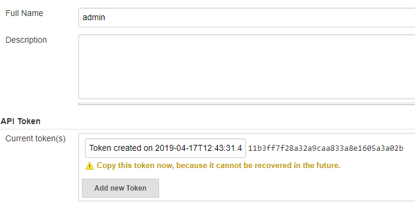

```
[JENKINS_USER] - Copy here field “Full Name”
[JENKINS_USER_TOKEN] - Copy here new generated token
```


## Perforce settings

1) Open cmd and execute "p4 -u [Admin Username] -p [Server Address] triggers"
2) Copy HandleCommit.sh to the perforce server machine
3) Add Trigger 

```
checkchanges change-commit [Engine Root] "[Path to the script]/HandleCommit.sh %change% %user%"
```

If you want to use perforce jobs to trigger build use:

```
checkchanges fix-add fix "[Path to the script]/HandleCommit.sh %change% %user%"
```
	
Where:
```
[Engine Root] - Root of the engine in the perforce depot (Example: //depot/TS_Unreal/...)
[Path to the script] - Path to the HandleCommit.sh script
```
	
4) Save and close triggers text document


## SVN settings

1) Add svn “post-commit” hook to your repository on the SVN Server following any SVN documentation
2) Past code from script “post-commit.bat’ in to the hook
3) Save settings


## Creating Jobs from templates

I.  Create DLL Builder Job to build your DLLs for the project automatically

1) On the Jenkins main page click “New Item”

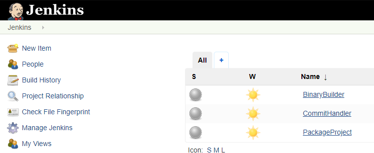

2) Fill next fields

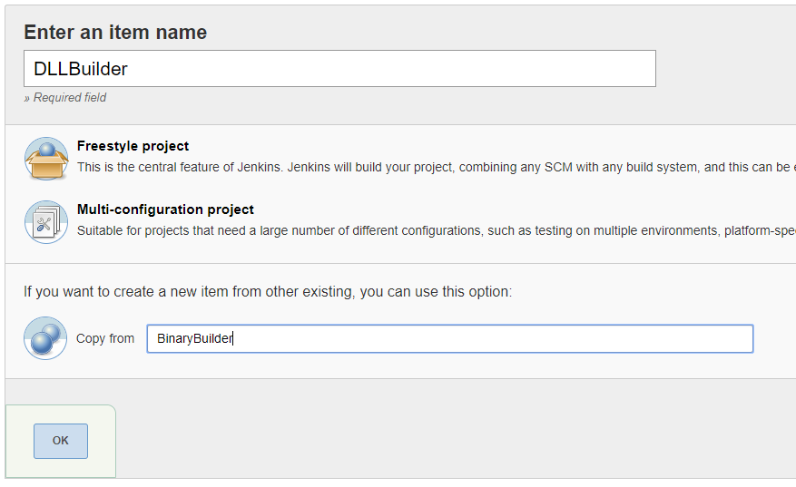

II. Create Job to Cook and Package your project

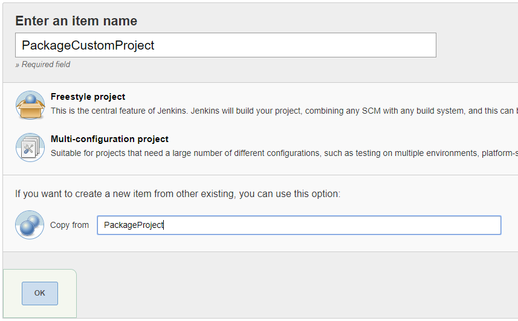

III. Create SCM Hook to trigger builds from commit comments or Perforce jobs

SVN:

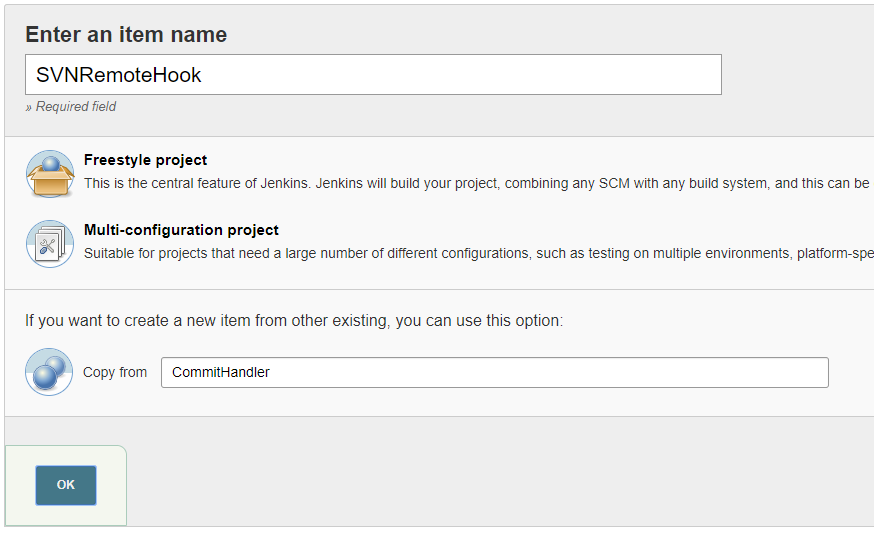

Make sure that Item name equals JobName in the svn post-commit hook script:

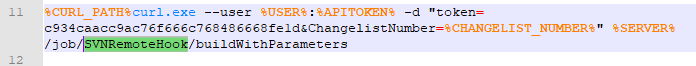

Perforce:

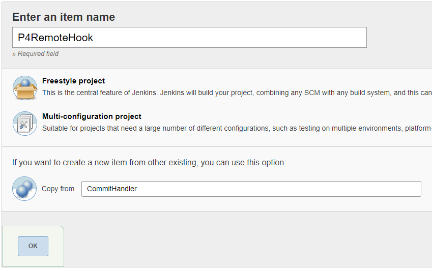

Make sure that Item name equals JobName in the Perforce HandleCommit trigger script:

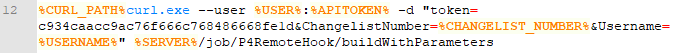

3) Open Configuration of this job and Configure next lines:

SVN:

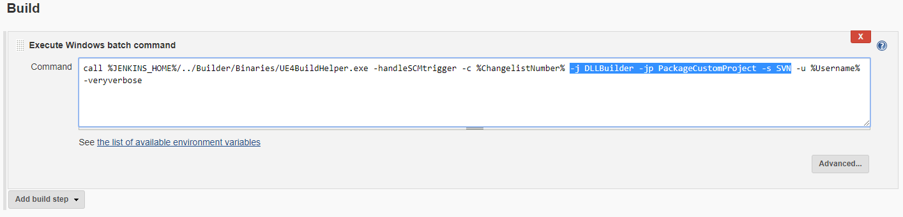

Perforce:

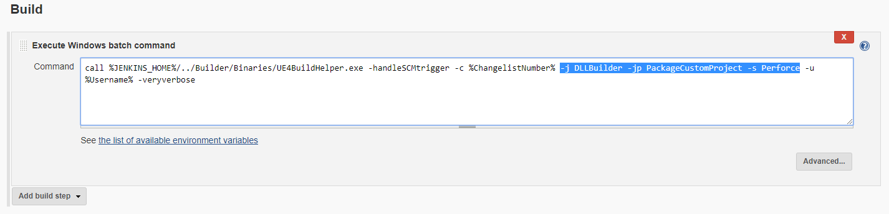


## Builder settings

1) Execute D:\CI\Jenkins\Builder\Binaries\UE4BuildHelper.exe
2) Create and configure Jenkins Job Bindings for each building jobs in this settings (DLLBuilder and PackageCustomProject in our case).

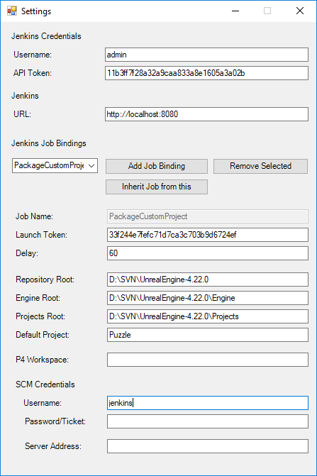	

Where:

```
Jenkins Credentials:
	Username - name of the admin user of the Jenkins
	API Token - API Token that was generated from the Jenkins “admin” user configuration page
```
		

	
```
Perforce Credentials:
	Username - the username of the p4 or SVN user of the server machine (Example: "jenkins")
	Password - Perforce ticket of this user. To generate ticket follow official Perforce documentation (You should use “p4 login -a” command with parameter -a to generate ticket. NOTE: needs only for Perforce, SVN required pre authorized user on this machine)

	Workspace - (Perforce only) Name of the workspace with the engine
	Server Address - (Perforce only) Address of the real perforce server (Example: SERVER_MACHINE:11000)

Jenkins:
	URL - URL of the Jenkins host (Example http://192.168.70.100:8080)

	Job Name - Name of the job of Jenkins
	Launch Token - Launch token for this job (In our case must be: 33f244e7fefc71d7ca3c703b9d6724ef). Located in the job settings 
```
		
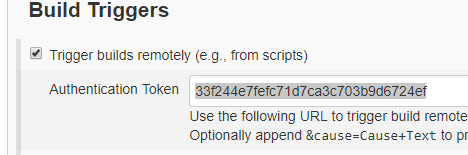
    
```
Delay - Delay before job (60 sec recommended)

Repository Root - Root for engine repository
Engine Root - Root of the engine directory
Projects Root - Root where is projects stored
Default Project - Default project for building (Example: Puzzle)
```


## Start

(Login: admin, Password: 123456)

1) D:\CI\Jenkins\Run.bat to start Jenkins server on the server machine and wait until "Jenkins is fully up and running" message in the output window.
2) Open http://[SERVER_MACHINE]:8080/job/DLLBuilder/ to see the status of your Job.
3) Try to commit some source code with [build] mark in the description.
4) Check status of the job in the Jenkins.

You can see the console output in realtime by clicking “Console Output” in current job page.

Adding new users to the Jenkins
	
Admin can add and configure new users with specific access permissions for each Jenkins Job.

To add new user log in to the Jenkins with admin user and go to Manage Jenkins -> Manage Users -> Create User
To configure global access permissions go to Manage Jenkins -> Configure Global Security. Set your permissions for authenticated users or specific users in the “Project-based Matrix Authorization Strategy”.
 Admin can override this permissions for specific job. Go to job settings and enable flag “Enable project-based security”

## Triggering Builds via Perforce Or SVN

### Building via web interface “Build with Parameters”

NOTE: Triggering Build DLL Job via web interface is not recommended, because it should be automated process.

Parameters:

```
Required:
Platform - building platform
Configuration - binary configuration

Optional:
bFullRebuild - Cleanup project and full rebuild
bForDistribution - Build distribution build
bSkipCook - Skip cook stage. In this case you should have already cooked content on the buildmachine

Upload/Config/Default*.ini - Upload users default config file of the project to the buildmachine and override it for this build

ProjectName - Project override. May be empty

SCMType - Must be “Perforce”
```

### Building via Perforce/SVN Hook

To trigger job via Perforce user should add to commit comment specific mark.

Syntax:

```
[(Build Action)|(Commit Action)+(Predefined Parameter)|(Project Override)] Comment Of the commit

`Build Action` - required mark to trigger build
`build` - just build
`rebuild` - full rebuild
`package` - Package only already cooked content on buildmachine (equivalent bSkipCook of web version)

`Commit Action` - (Optional) Commit type or platform specification
  `engine` - (DLL commit type) commit only engine binaries after building DLL
  `project` - (DLL commit type) commit only project binaries after building DLL
`all` or empty - (DLL commit type) commit all binaries after building DLL
`ios` - (package build option) compile, cook and package iOS Build
`android` - (package build option) compile, cook and package Android Build
`win` - (package build option) compile, cook and package Windows (64-bit) Build

`Project Override` - (Optional, Case-sensitive), Override project by default by your other project that stores in “Projects Root” directory

`Predefined Parameter`
`upload` - Trigger upload build Job after building
```


Examples:

```
[build] - Build DLL and commit all binaries
[rebuild] - Rebuild DLL and commit all binaries
[build|project] - Build DLL and commit only project binaries
[build+MyProject] - build and commit DLL of the MyProject
[build|win] - compile, cook and package Win64 build
[rebuild|win] - full recompile, recook and package Win64 b
uild
[build|win+MyProject] - compile, cook and package Win64 build for MyProject
[package|win] - compile and package Win64 build with already cooked content
[build|win+upload] - compile, cook and package Win64 build and trigger upload after building
```

Packaged build are staged on http://[JENKINS_SERVER_URL]:8080/job/PackageCustomProject/ws/ 

### Builds triggering based on Perforce Jobs.

Please read https://www.perforce.com/perforce/doc.current/manuals/p4guide/Content/P4Guide/chapter.jobs.html for details.

Perforce administrator should add next jobs to the perforce settings:

Main Actions:

```
Build   - if using without Sub Action then DLL Build will be triggered
Rebuild - if using without Sub Action then DLL Rebuild will be triggered
PackageOnly - skip cook stage
```
        
Sub Actions:

```
PackageWin64    - Compile, Cook and Package Windows 64 game
PackageIOS  - Compile, Cook and Package IOS game
PackageAndroid  - Compile, Cook and Package Android game
```        
Options:

```
Upload  - Upload build if uploader job is exists
```
    
User can combine these categories of the jobs as well as build tags in the comment of the commit.
        
Examples:

```
Trigger DLL Build
    \/ Build 

Trigger Build, Cook and Package of the Windows 64 game
    \/ PackageWin64

Trigger Full Rebuild, Recook and Package of the Windows 64 game:
    \/ Rebuild
    \/ PackageWin64

Trigger Build and Package of the Windows 64 game and upload if uploader job is exists
    \/ PackageOnly
    \/ PackageWin64
    \/ Upload
```
